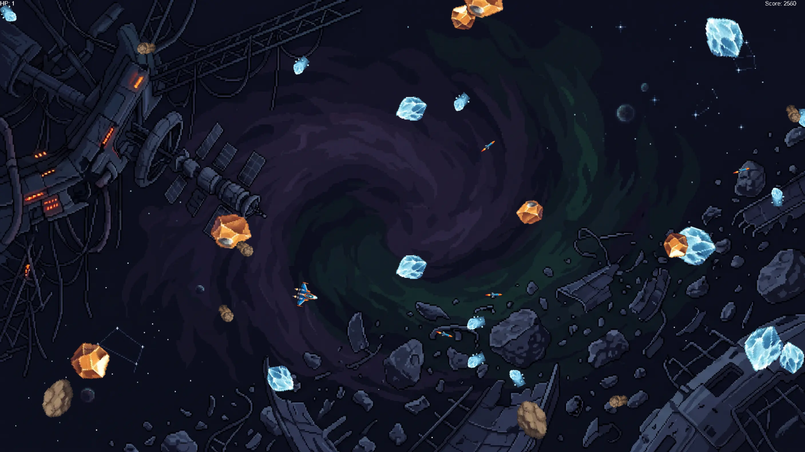

# 
SpaceShooter 2D

## Contexte :

J'ai réalisé ce jeu 2D de type ***SpaceShooter*** pour apprendre les bases des langages C et C++, ainsi qu'à utiliser vcpkg dans Visual Studio Code avec l'extension cmake.

## Commandes :

Les boutons de la souris permettent au joueur de tirer et les touches **Z, Q, S, D** permettent de se déplacer. 

Pour mettre le jeu en pause, il faut appuyer sur **ECHAP** pour la version Windows et **E** pour la version web.

## Joueur :

Le joueur est un petit vaisseau spatial qui apparaît au centre de l'écran au début de la partie. Il a 3 vies affichées en haut à gauche et un score affiché en haut à droite.

## Types d'Ennemis :

Il existe 3 types d'astéroïdes qui rapportent tous 20 points lors de leur destruction:

- **Rocheux**, ce sont les astéroïdes de base;

- **Métalliques**, plus clairs que les astéroïdes rocheux, ils ont une chance d'apparaître avec un morceau de métal qui leur confère une protection contre le premier projectile rencontré;

- **Glaciaux**, ralentissent le joueur pendant 5 secondes s'ils le touches;

## Bibliothèques utilisées :

- SDL2

- SDL2_ttf

- SDL2_image

## Structure du code :

Ce projet ayant été réalisé sur plusieurs années et ayant été réécrit dans différents langages, j'ai restructuré voire recommencé plusieurs parties du code plusieurs fois.

### 1. Version C

Pour la version C, il n'existait que quelques fichiers qui étaient compilés à l'aide de la commande gcc directement dans un terminal:

- main.c qui servait à appeler la classe game;

- Game.c qui regroupait toutes les actions et les entités (joueur, projectiles, astéroïdes ...), ainsi que les fonctions utilitaires comme ajouter un texte à un rendu, la fonction Random permettant de générer un nombre aléatoire... ;

- joueur.c qui représentait le joueur;

- asteroid.c qui représentait les différents types d'astéroïdes;

### 2. Version C++ (finale)

Passer au C++ m'a permis de revoir la structure globale de mon projet ainsi que d'utiliser cmake et vcpkg pour gérer les bibliothèques que j'ai utilisées et pour compiler le code. Ainsi que de passer au compilateur **MSVC** pour la version Windows et **Emscripte** pour ajouter un support web ([disponible ici](https://valentin-ledur.github.io/valentin-ledur/spaceshooter/launch.html)). 

Pour cette version, je suis passé d'une structure monolithique où la classe ***Game*** gérait tout à un système de ***managers*** pour séparer les différentes responsabilités:

- PlayerManager qui s'occupe des **actions relatives au joueur**;

- EnemyManager qui s'occupe de la **génération des astéroïdes**;

- UIManager qui s'occupe de la **création des éléments des menus (start, play, game_over et pause)**;

- ProjectileManager qui s'occupe de **la création et des déplacements des projectiles du joueur**;

- La classe Game, qui s'occupe **d'appeler tous les managers et de gérer les collisions entre les entités**;

- Le namespace ***Utils*** regroupe les fonctions utilitaires qui servent entre autres à **créer une texture ou générer un nombre aléatoire**;

## Compilation

### Prérequis

Avant de compiler le projet, assurez-vous d'avoir installé les outils suivants sur votre machine :

- [Git](https://git-scm.com/);

- [CMake](https://cmake.org/);

- [MSVC](https://visualstudio.microsoft.com/fr/) pour Windows;

- [vcpkg](https://vcpkg.io/) (pour la gestion des bibliothèques SDL2);

- [Emscripten](https://emscripten.org/) si vous souhaitez compiler la version Web;

### Installation

Commencez par cloner le projet : 

`git clone https://github.com/Valentin-Ledur/SpaceShooter.git` 

`cd spaceshooter` 

### 1. Version Windows (MSVC)

Si vous utilisez Visual Studio Code, vous pouvez ouvrir le projet et utiliser l'extension CMake. Grâce au fichier CMakePresets.json inclus dans le projet, il vous suffit d'utiliser les boutons présents dans l'interface de Visual Studio Code pour configurer et compiler automatiquement.

Pour compiler manuellement en ligne de commande : 

`cmake -B build -S . -DCMAKE_TOOLCHAIN_FILE="chemin/vers/vcpkg/scripts/buildsystems/vcpkg.cmake"` 

`cmake --build build`

### 2. Version Web (Emscripten)
Pour compiler la version Web, il suffit de créer une variable d'environnement système EMSDK contenant le chemin vers votre installation Emscripten. 

Ensuite, utilisez le wrapper CMake d'Emscripten pour générer le projet : 

`emcmake cmake -B build_web -S . -DCMAKE_TOOLCHAIN_FILE="chemin/vers/vcpkg/scripts/buildsystems/vcpkg.cmake"` 

`cmake --build build_web` 
