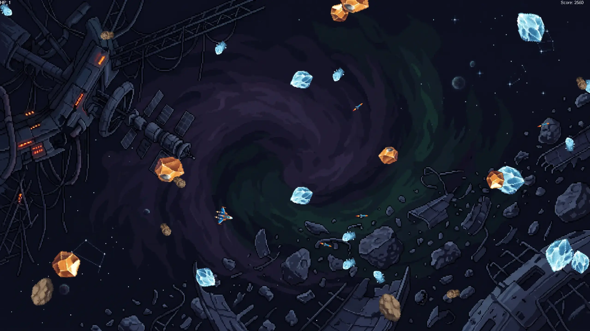

# SpaceShooter 2D

## Contexte :

J'ai réalisé ce jeu 2D de type ***SpaceShooter*** pour apprendre les bases des langages C et C++, ainsi qu'à utiliser vcpkg dans Visual Studio Code avec l'extension cmake.

## Commandes :

Les boutons de la souris permettent au joueur de tirer et les touches **Z, Q, S, D** permettent de se déplacer. 

Pour mettre le jeu en pause, il faut appuyer sur **ECHAP** pour la version Windows et **E** pour la version web.

## Joueur :

Le joueur est un petit vaisseau spatial qui apparaît au centre de l'écran au début de la partie. Il a 3 vies affichées en haut à gauche et un score affiché en haut à droite.

## Types d'Ennemis :

Il existe 3 types d'astéroïdes qui rapportent tous 20 points lors de leur destruction:

- **Rocheux**, ce sont les astéroïdes de base;

- **Métalliques**, plus clairs que les astéroïdes rocheux, ils ont une chance d'apparaître avec un morceau de métal qui leur confère une protection contre le premier projectile rencontré;

- **Glaciaux**, ralentissent le joueur pendant 5 secondes s'ils le touchent;

## Bibliothèques utilisées :

- SDL2

- SDL2_ttf

- SDL2_image

## Structure du code :

Ce projet ayant été réalisé sur plusieurs années et ayant été réécrit dans différents langages, j'ai restructuré voire recommencé plusieurs parties du code plusieurs fois.

### 1. Version C

Pour la version C, il n'existait que quelques fichiers qui étaient compilés à l'aide de la commande gcc directement dans un terminal:

- main.c qui servait à appeler la classe game;

- Game.c qui regroupait toutes les actions et les entités (joueur, projectiles, astéroïdes ...), ainsi que les fonctions utilitaires comme ajouter un texte à un rendu, la fonction Random permettant de générer un nombre aléatoire... ;

- joueur.c qui représentait le joueur;

- asteroid.c qui représentait les différents types d'astéroïdes;

### 2. Version C++ (finale)

Passer au C++ m'a permis de revoir la structure globale de mon projet ainsi que d'utiliser cmake et vcpkg pour gérer les bibliothèques que j'ai utilisées et pour compiler le code. Ainsi que de passer au compilateur **MSVC** pour la version Windows et **Emscripten** pour ajouter un support web ([disponible ici](https://valentin-ledur.github.io/valentin-ledur/spaceshooter/launch.html)). 

Pour cette version, je suis passé d'une structure monolithique où la classe ***Game*** gérait tout à un système de ***managers*** pour séparer les différentes responsabilités:

- PlayerManager qui s'occupe des **actions relatives au joueur**;

- EnemyManager qui s'occupe de la **génération des astéroïdes**;

- UIManager qui s'occupe de la **création des éléments des menus (start, play, game_over et pause)**;

- ProjectileManager qui s'occupe de **la création et des déplacements des projectiles du joueur**;

- La classe Game, qui s'occupe **d'appeler tous les managers et de gérer les collisions entre les entités**;

- Le namespace ***Utils*** regroupe les fonctions utilitaires qui servent entre autres à **créer une texture ou générer un nombre aléatoire**;

## Compilation

Commencez par cloner le projet :

`git clone https://github.com/Valentin-Ledur/SpaceShooter.git`

`cd SpaceShooter`

Ensuite, assurez-vous d'avoir installé **vcpkg** ainsi que d'avoir créé la variable d'environnement
**VCPKG_ROOT**, mais aussi **Emscripten** et la variable **EMSDK** si vous souhaitez compiler pour le Web.

### Visual Studio Code

Pour compiler à l'aide de l'interface de Visual Studio Code, vous aurez besoin de l'extension CMake, ainsi que d'exécuter Visual Studio Code dans un terminal ayant accès au compilateur correspondant à la plateforme que vous visez (MSVC pour Windows et Emscripten pour le Web). Ensuite, si vous avez configuré correctement votre environnement, vous n'aurez plus qu'à utiliser l'interface de Visual Studio Code pour compiler/exécuter le programme.

### CMake Windows

Pour compiler en ligne de commande pour Windows :

`cmake -B build -S . --preset windows`

`cmake --build build`

### CMake Emscripten

Pour compiler en ligne de commande pour le Web :

`cmake -B build -S . --preset web`

`cmake --build build`
